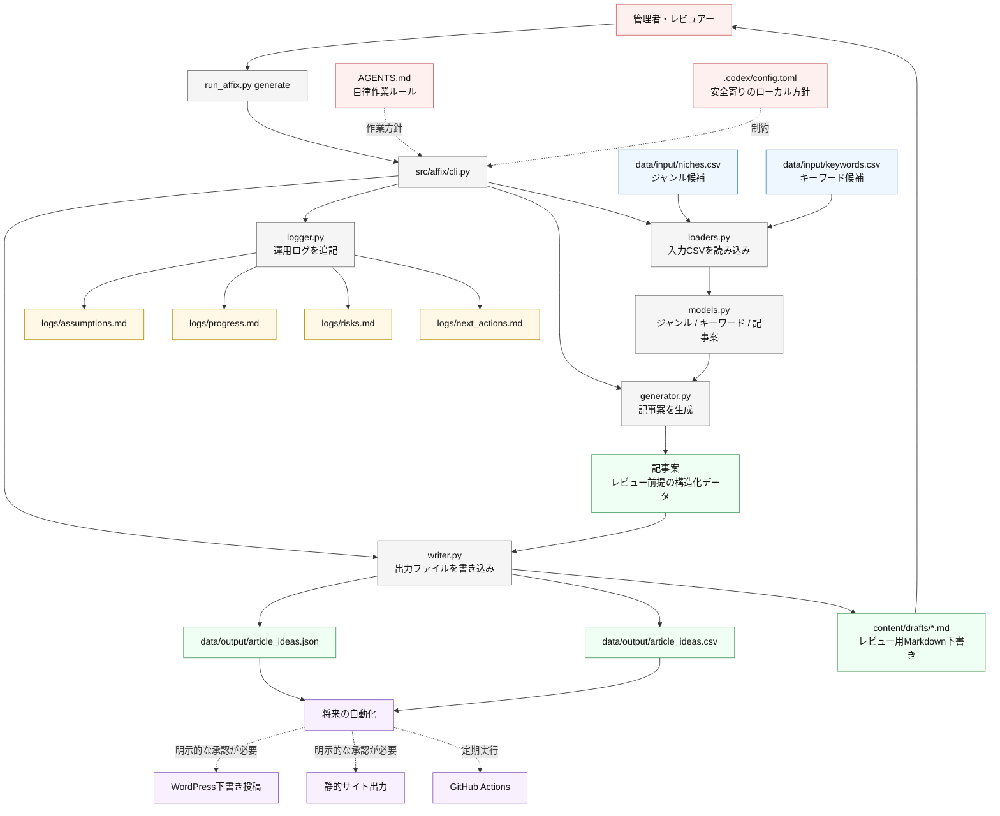

# Affix

Affixは、アフィリエイトサイト運営を自動化するための最小開発基盤です。

現在の版では、安全性を優先し、記事の完全自動公開ではなく「人間が確認するための記事案とMarkdown下書き」を生成します。ジャンルCSVとキーワードCSVを読み込み、記事案をJSON/CSVで保存し、レビュー用のMarkdown下書きと運用ログを出力します。

## Affixが自動化すること

- ジャンル候補の管理
- キーワード候補の管理
- 記事案の生成
- レビュー用Markdown下書きの作成
- アフィリエイト導線案の整理
- 進捗、仮定、リスク、次アクションのログ保存

## まだ自動化しないこと

- WordPressへの自動公開
- 静的サイトの自動デプロイ
- 実検索ボリュームの取得
- 商品価格やランキングの自動検証
- アフィリエイトネットワークAPI連携
- 法務、金融、医療、コンプライアンス判断
- 人間承認なしの公開

## 管理者ユーザーが最初にやること

1. このリポジトリを取得します。

```bash
git clone https://github.com/ganase/affix.git
cd affix
```

2. 入力CSVを確認します。

- `data/input/niches.csv`: 扱うジャンル候補
- `data/input/keywords.csv`: 記事化したいキーワード候補

3. 必要に応じてCSVを編集します。

まずはサンプルのまま実行できます。実運用を始める場合は、ジャンル名、キーワード、検索意図、優先度、注意事項を自分のサイト方針に合わせて更新してください。

4. 記事案と下書きを生成します。

```bash
python run_affix.py generate
```

5. 出力を確認します。

- `data/output/article_ideas.json`
- `data/output/article_ideas.csv`
- `content/drafts/*.md`
- `logs/*.md`

6. 公開前に人間レビューを行います。

生成されたMarkdownは下書きです。価格、機能、ランキング、口コミ、公式推薦、アフィリエイト開示、YMYLリスクを確認してから公開判断をしてください。

## システム構成



詳細な構成メモは `docs/system_architecture.md` にもあります。

## ディレクトリ構成

```text
affix/
  AGENTS.md
  TASK.md
  README.md
  .codex/
    config.toml
  data/
    input/
      niches.csv
      keywords.csv
    output/
      article_ideas.json
      article_ideas.csv
  content/
    drafts/
  logs/
    assumptions.md
    progress.md
    risks.md
    next_actions.md
  src/
    affix/
      __init__.py
      cli.py
      models.py
      loaders.py
      generator.py
      writer.py
      logger.py
  tests/
    test_smoke.py
  run_affix.py
```

## セットアップ

追加インストールは不要です。AffixはPython標準ライブラリだけで動きます。

可能であればPython 3.10以上を使用してください。

## 実行コマンド

```bash
python run_affix.py generate
```

## 入力CSV

`data/input/niches.csv` にはジャンル単位の情報を入れます。

- `niche_id`
- `niche_name`
- `description`
- `monetization_type`
- `ymyl_risk`
- `competition_level`
- `notes`

`data/input/keywords.csv` にはキーワード単位の情報を入れます。

- `keyword_id`
- `niche_id`
- `keyword`
- `search_intent`
- `funnel_stage`
- `article_type`
- `priority`
- `notes`

キーワードは `niche_id` でジャンルに紐づきます。

## 出力ファイル

`data/output/article_ideas.json` は、将来の自動化で使いやすい構造化された記事案です。

`data/output/article_ideas.csv` は、表計算ソフトで確認しやすい記事案です。

`content/drafts/` には、記事案ごとのMarkdown下書きが保存されます。これらはレビュー用であり、自動公開してはいけません。

`logs/` には追記型の運用ログが保存されます。

- `assumptions.md`
- `progress.md`
- `risks.md`
- `next_actions.md`

## 人間レビューが必要な理由

アフィリエイト記事では、価格、ランキング、機能、公式推薦、口コミを根拠なく書くと、読者を誤解させるリスクがあります。

そのためAffixの生成物は、公開前の下書きとして扱います。金融、健康、医療、保険、法律、投資などのYMYL領域では特に慎重に確認してください。

## 今後の拡張案

- 人間承認後のWordPress下書き作成
- 静的サイトジェネレーターへの出力
- GitHub Actionsによる定期更新
- 手動エクスポートした検索ボリュームCSVの取り込み
- アフィリエイトリンク台帳と開示文管理
- 商品情報の事実確認フロー
- レビュー報告書の生成
- 重複キーワードのクラスタリング
