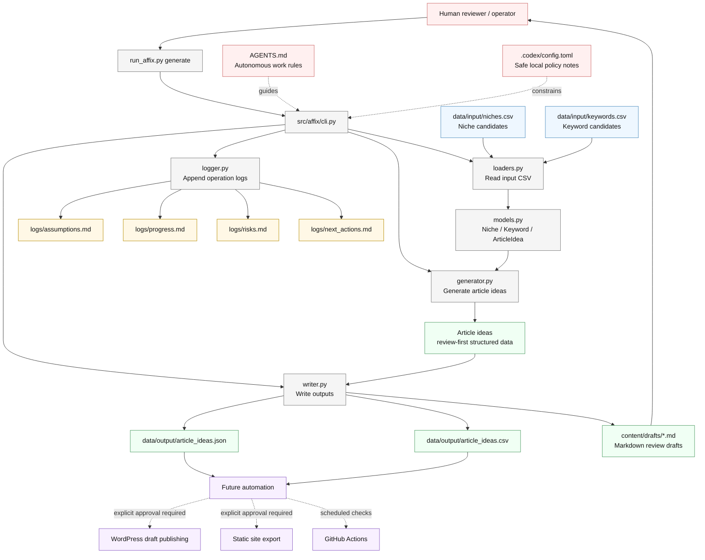

# Affix

Affix is a minimal development foundation for an automated affiliate website operation system.

The current version focuses on safe, review-first article planning. It combines niche and keyword CSV files, generates article ideas, writes structured output, and creates Markdown drafts for human review.

## What Affix automates

- niche candidate management
- keyword candidate management
- article idea generation
- review-ready Markdown draft creation
- affiliate angle planning
- progress, assumption, risk, and next-action logging

## What Affix does not automate yet

- automatic WordPress publishing
- static site deployment
- real keyword volume collection
- product price or ranking verification
- affiliate network API integration
- legal, financial, medical, or compliance approval
- publishing without human approval

## System architecture



Detailed architecture notes are also available in `docs/system_architecture.md`.

## Directory structure

```text
affix/
  AGENTS.md
  TASK.md
  README.md
  .codex/
    config.toml
  data/
    input/
      niches.csv
      keywords.csv
    output/
      article_ideas.json
      article_ideas.csv
  content/
    drafts/
  logs/
    assumptions.md
    progress.md
    risks.md
    next_actions.md
  src/
    affix/
      __init__.py
      cli.py
      models.py
      loaders.py
      generator.py
      writer.py
      logger.py
  tests/
    test_smoke.py
  run_affix.py
```

## Setup

No installation is required. Affix uses only the Python standard library.

Use Python 3.10 or newer if possible.

## Run

```bash
python run_affix.py generate
```

## Input CSV files

`data/input/niches.csv` contains niche-level data:
- `niche_id`
- `niche_name`
- `description`
- `monetization_type`
- `ymyl_risk`
- `competition_level`
- `notes`

`data/input/keywords.csv` contains keyword-level data:
- `keyword_id`
- `niche_id`
- `keyword`
- `search_intent`
- `funnel_stage`
- `article_type`
- `priority`
- `notes`

Keywords are matched to niches by `niche_id`.

## Output files

`data/output/article_ideas.json` contains structured article ideas for downstream automation.

`data/output/article_ideas.csv` contains the same article ideas in spreadsheet-friendly format.

`content/drafts/` contains one Markdown draft per article idea. These files are for review and should not be published automatically.

`logs/` contains append-only operational notes:
- `assumptions.md`
- `progress.md`
- `risks.md`
- `next_actions.md`

## Why human review is required

Affiliate content can easily become misleading if it invents prices, rankings, feature claims, endorsements, or reviews.

Affix therefore treats generated content as a draft. Human review is required before publication, especially for YMYL topics such as finance, health, medicine, insurance, legal, and investment.

## Future extensions

- WordPress draft creation after explicit approval
- static site generator export
- GitHub Actions scheduled refresh
- keyword volume import from manually exported CSV files
- affiliate link inventory and disclosure management
- product fact-check workflow
- review report generation
- duplicate keyword clustering
