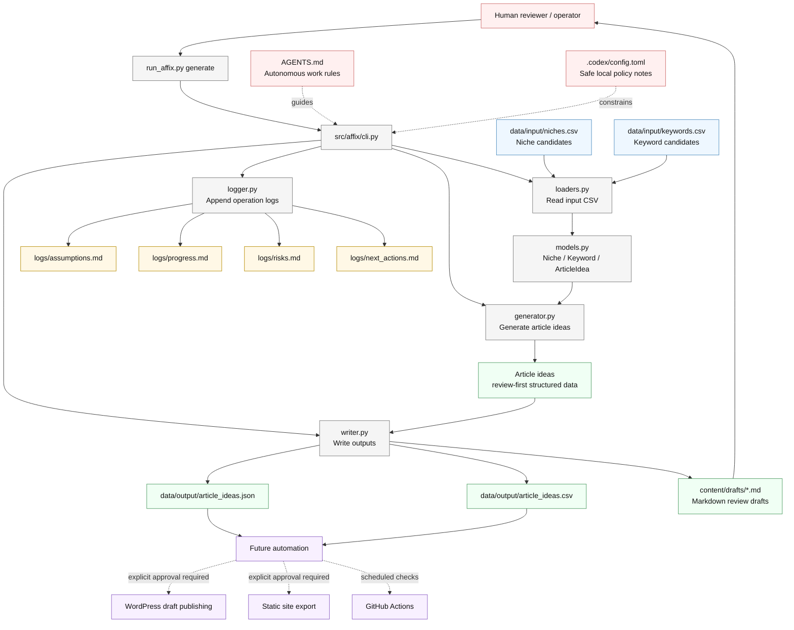

# System Architecture

## Notes

- Current automation stops at review-ready article idea and Markdown draft generation.
- Publishing integrations are intentionally future components and require explicit human approval.
- Generated content is treated as draft material until facts, affiliate disclosure, and YMYL risks are reviewed.
