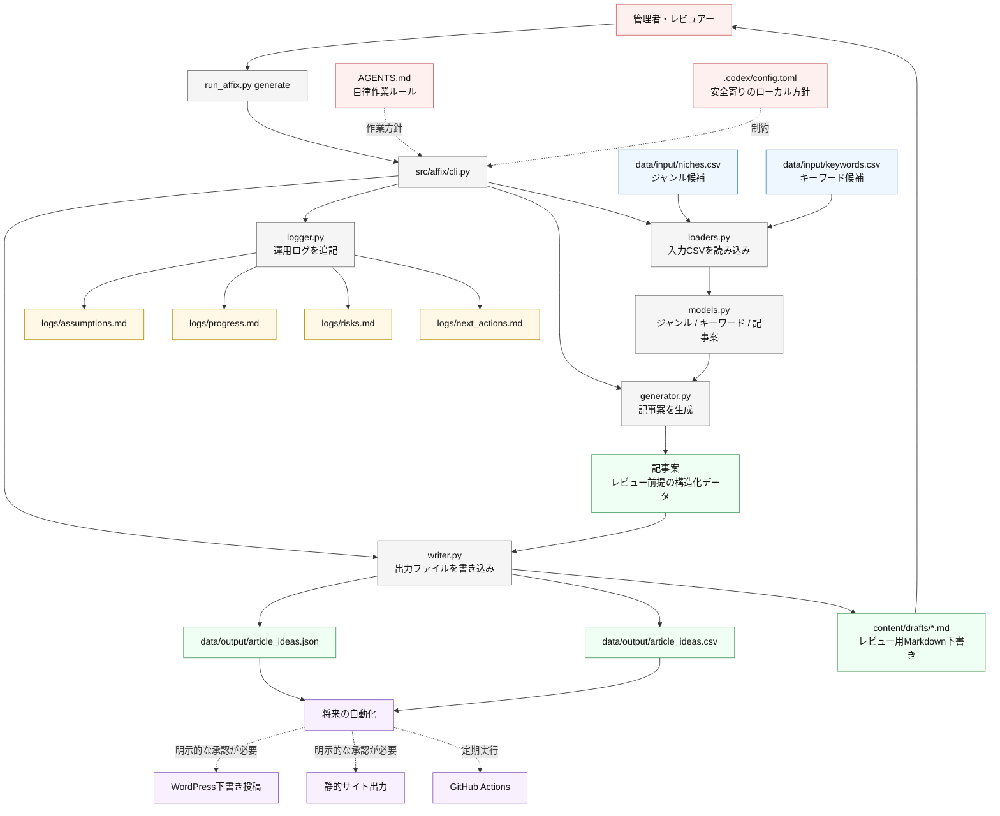

# システム構成

```mermaid
flowchart TD
    A["管理者・レビュアー"] --> B["run_affix.py generate"]

    B --> C["src/affix/cli.py"]
    C --> D["loaders.py<br/>入力CSVを読み込み"]
    C --> E["generator.py<br/>記事案を生成"]
    C --> F["writer.py<br/>出力ファイルを書き込み"]
    C --> G["logger.py<br/>運用ログを追記"]

    H["data/input/niches.csv<br/>ジャンル候補"] --> D
    I["data/input/keywords.csv<br/>キーワード候補"] --> D

    D --> J["models.py<br/>ジャンル / キーワード / 記事案"]
    J --> E

    E --> K["記事案<br/>レビュー前提の構造化データ"]

    K --> F
    F --> L["data/output/article_ideas.json"]
    F --> M["data/output/article_ideas.csv"]
    F --> N["content/drafts/*.md<br/>レビュー用Markdown下書き"]

    G --> O["logs/assumptions.md"]
    G --> P["logs/progress.md"]
    G --> Q["logs/risks.md"]
    G --> R["logs/next_actions.md"]

    N --> A
    L --> S["将来の自動化"]
    M --> S

    S -. 明示的な承認が必要 .-> T["WordPress下書き投稿"]
    S -. 明示的な承認が必要 .-> U["静的サイト出力"]
    S -. 定期実行 .-> V["GitHub Actions"]

    W["AGENTS.md<br/>自律作業ルール"] -. 作業方針 .-> C
    X[".codex/config.toml<br/>安全寄りのローカル方針"] -. 制約 .-> C

    classDef c1 fill:#eef7ff,stroke:#4b8bbe,color:#111;
    classDef c2 fill:#f5f5f5,stroke:#777,color:#111;
    classDef c3 fill:#f0fff4,stroke:#4c9a62,color:#111;
    classDef c4 fill:#fff8e6,stroke:#b58b00,color:#111;
    classDef c5 fill:#f8f0ff,stroke:#8a5cc2,color:#111;
    classDef c6 fill:#fff0f0,stroke:#cc6666,color:#111;

    class H,I c1;
    class B,C,D,E,F,G,J c2;
    class K,L,M,N c3;
    class O,P,Q,R c4;
    class S,T,U,V c5;
    class A,W,X c6;
```

## メモ

- 現在の自動化は、レビュー用の記事案とMarkdown下書きの生成までで止めます。
- 公開連携は将来の機能であり、実装する場合も明示的な人間承認を必須にします。
- 生成内容は、事実確認、アフィリエイト開示、YMYLリスク確認が終わるまで下書きとして扱います。
